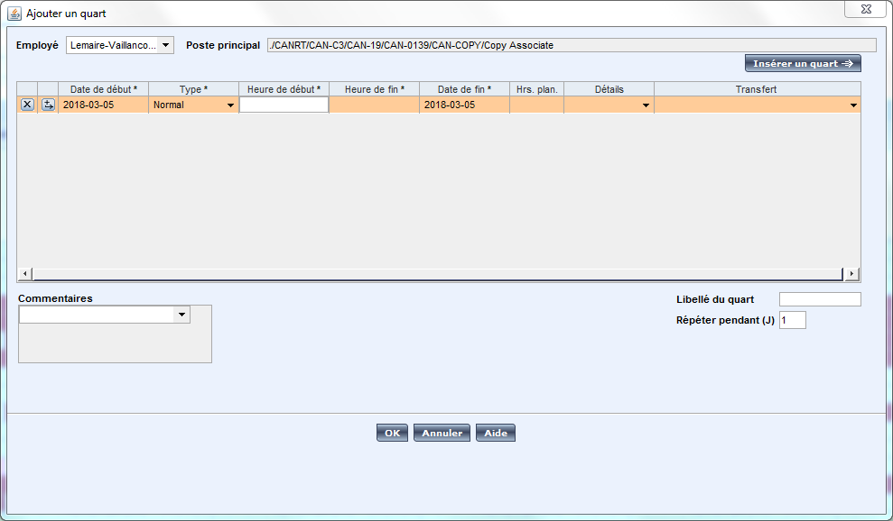
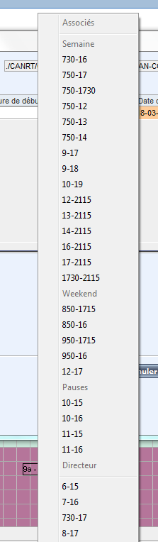

# Auto-Horaire

## Usage
Ouvrez le programme, une icône s'ajoutera à gauche de l'heure dans la barre des tâches pour indiquer qu'il est en fonction.

Dans le planificateur d'horaire, cliquez avec le bouton droit de la souris sur la case horaire désirée et choisissez `Ajouter un quart`.

Une fois la fenêtre de nouveau quart ouverte, assurez-vous d'avoir le curseur dans le champ `Heure de début` et appuyez sur la roulette de défilement de votre souris pour afficher le menu et sélectionnez le quart souhaité. Attendez que le programme *tape* automatiquement les valeurs de tous les champs pour vous, et cliquez sur `OK`.

